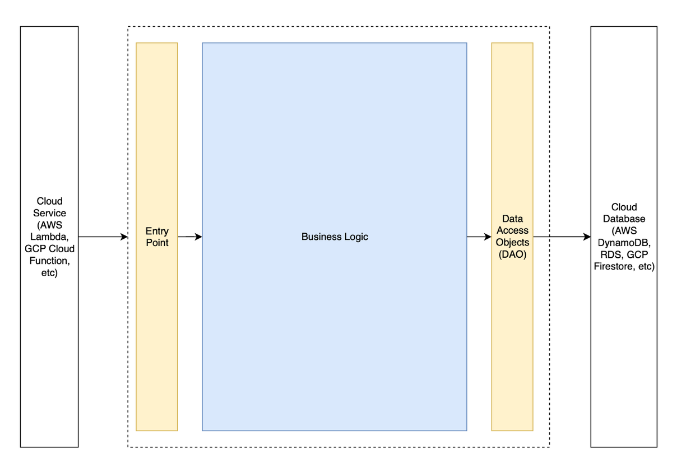

## Multi-Cloud Application Development Design Patterns

### Summary
This repo contains a sample multicloud application development pattern written in Java, C#, TypeScript, and Python.  All languages have been tested using AWS and either GCP or Azure.

This pattern makes it possible to run the same application business logic on multiple cloud providers using each provider's 
proprietary services. For example, instead of "lowest common denominator" technologies such as Kubernetes and Kafka, an 
application could be built to use AWS Lambda with DynamoDB on AWS, GCP Cloud Functions with Firestore on GCP, and Azure 
Functions with CosmosDB on Azure. This makes applications portable between cloud providers, which can save time and money 
for organizations that want to be able to deploy their applications to multiple clouds.

In each of the language directories in this repo (ex: `/java`, `/python`, etc), there is code for a sample person REST API.
The API has 2 endpoints:

1. A `POST` endpoint that persists a person object to a NoSQL database.
2. A `GET` endpoint that retrieves a person object by ID from a NoSQL database.

Each directory includes a `/core` directory (named `mcacore` in `/python`'s case) that contains the API's cloud-agnostic 
business logic.  Each directory also contains a `/deployments` directory (except for `/python`), which contains a directory 
with "wrapper" code for each targeted cloud provider: 1) AWS and 2) GCP or Azure.

[//]: # (The following video shows the AWS and GCP Java artifacts being built and invoked using Postman.  You can see how the REST API)

[//]: # (runs the same business logic.  From the client's perspective, the only difference is that the invocation URLs' domains are different because one API runs)

[//]: # (on AWS and the other runs on GCP.)

[//]: # (<video width="900" height="500" controls src="multicloud_java_build_and_test.mp4"></video>)

The following architectural diagram describes how the pattern accomplishes this.  The dotted box is an artifact that the 
build process outputs.  The blue box is the "core" business logic, which is cloud-agnostic - it should not have any cloud 
SDKs as dependencies.  The thin yellow boxes are the thin cloud-specific "wrappers" that implement minimal - and often times 
boilerplate - cloud-specific logic.  This pattern allows us to swap cloud-specific wrappers around the business logic, so 
that the application business logic can run on different cloud providers and take advantage of proprietary cloud services rather
than "lowest common denominator" services.



Below are instructions to automatically build and deploy the cloud-specific artifacts for each language.  The end result
is that you are able to reuse and run your cloud-agnostic business logic - the vast majority of each artifact's code -
in each of the targeted cloud providers by "wrapping" the business logic in thin cloud-specific wrappers.

## Java

To build the Java multi-cloud design pattern, do the following:

1. From the `java` directory, run `mvn clean install`.  This builds every modules' artifacts, including one for each 
cloud provider, such as GCP, AWS, Azure, etc. if they exist in the project under the `/deployments` directory.

To test the artifacts in the cloud, do the following:

##### AWS Lambda
1. Deploy the jar under `./deployments/aws-lambda/target` to the AWS Lambda service manually by uploading the jar through
the AWS Lambda console.
2. To test the Lambda function, create a test event with the following payload:
```json
{
   "httpMethod": "POST",
   "path": "/person",
   "body": "{\"firstName\": \"Bob\", \"lastName\": \"Ross\", \"dateOfBirth\": \"1970-01-01T13:30:30+05:00\"}",
   "queryStringParameters": {}
}
```
3. Using the id in the response body, create another test event as follows (replace the `id` placeholder):
```json
{
   "httpMethod": "GET",
   "path": "/person",
   "body": "",
   "queryStringParameters": {
      "id": "PREVIOUS_ID_RETURNED_GOES_HERE"
   }
}
```
Save and execute the test.  The response body should contain the object you persisted in the prior step.

##### GCP Cloud Functions
1. Deploy the jar under `./deployments/gcp-cloud-function/target` to the GCP Cloud Function service manually by doing the following:
   1. Open the gcloud terminal.
   2. Upload the jar into the glcoud terminal.
   3. Run `gcloud functions deploy {cloud function name} --entry-point=com.amazon.Main --runtime=java11 --trigger-http --source=.`.
   Be sure to replace the `cloud function name` placeholder. The output of this command should show the URL that can be called to invoke this GCP Cloud Function.
2. To test persisting an object to Firestore, run the following (make sure to replace the placeholder text with the GCP Cloud Function URL):
```shell
curl -X POST -H "Content-Type: application/json" -d '{"firstName": "Bob", "lastName": "Ross", "dateOfBirth": "1970-01-01T00:05:00Z"}' {paste the URL here}/person
```
3. To test retrieving an object from Firestore, run the following (again, make sure to replace the id placeholder with the id that was in the prior `curl` command's response body):
```shell
curl {paste the URL here}/person?id={paste the id here}
```
The response should contain the object you persisted in the previous step.

## TypeScript

To build the TypeScript artifacts, do the following:

1. Ensure you have Node version 18 installed on your machine.  
2. From the `typescript` directory, run `npm install` to install all project dependencies.
3. Then run `npm run tsc` to transpile the TypeScript project to JavaScript.

***Note:  To add the `core` library as a dependency for each of the deployment libraries, run the following command:  `npm install core --workspace deployments/aws-lambda`.  Replace
`deployments/aws-lambda` with the necessary deployment library. 

##### AWS Lambda
1. From the `./deployments/aws-lambda` directory , run `npm run build` to produce a single-file node module.  Please note, you may want to consider minifying the single module file.
2. To deploy the resulting `./dist/index.js` file, create a Node18 Lambda function, upload the `./dist/index.zip` file, and set the Lambda handler to `index.lambdaHandler`.
3. To test the Lambda function, create a test event with the following payload:
```json
{
   "httpMethod": "POST",
   "path": "/person",
   "body": "{\"firstName\": \"Bob\", \"lastName\": \"Ross\", \"dateOfBirth\": \"1970-01-01\"}",
   "queryStringParameters": {}
}
```
4. Using the id in the response body, create another test event as follows (replace the `id` placeholder):
```json
{
   "httpMethod": "GET",
   "path": "/person",
   "body": "",
   "queryStringParameters": {
      "id": "PREVIOUS_ID_RETURNED_GOES_HERE"
   }
}
```
Save and execute the test.  The response body should contain the object you persisted in the prior step.

##### GCP Cloud Functions
1. From the `./deployments/gcp-cloud-functions` directory , run `npm run build` to produce a single-file node module.  Please note, you may want to consider minifying the single module file.
2. Deploy the `index.js` file under `./deployments/gcp-cloud-function/dist` to the GCP Cloud Function service manually by doing the following:
   1. Open the gcloud terminal.
   2. Upload the `index.js` file into the gcloud terminal.
   3. Run `gcloud functions deploy {cloud function name} --entry-point=main --runtime nodejs18 --trigger-http --allow-unauthenticated --source=.`. 
   Be sure to replace the `cloud function name` placeholder.  If this command outputs an error about the project not being set, set the project by running
   `gcloud config set project {the project id that the cloud function is in}`.
3. Test the GCP Cloud Function by running `curl --location --request GET '{URL of the cloud function}/person?id=b5c03ecc-ffaf-4b8d-8dd8-762043149d55'`.
   The `URL of the cloud function` placeholder should be replaced with the GCP Cloud Function Trigger URL.
4. To test persisting an object to Firestore, run the following (make sure to replace the placeholder text with the GCP Cloud Function URL):
```shell
curl -X POST -H "Content-Type: application/json" -d '{"firstName": "Sammy", "lastName": "Joe", "dateOfBirth": "1950-02-01"}' {paste your URL here}/person
```
5. To test retrieving an object from Firestore, run the following (again, make sure to replace the id placeholder with the id that was in the prior `curl` command's response body):
```shell
curl {paste your URL here}/person?id={paste the id here}
```
The response should contain the object you persisted in the previous step.


## .NET

To build the .NET artifacts, do the following:

1. Ensure you have the `dotnet` CLI version `7.0.302` installed on your machine.

***Note:  To add the `core` library as a dependency for each of the deployment libraries, run the following command:  
`dotnet add deployments/aws-lambda/ reference core/core.csproj`.  Replace `deployments/aws-lambda` with the necessary 
deployment library.

##### AWS Lambda
1. From the `./deployments/aws-lambda` directory, run `dotnet restore` to install all project dependencies.
2. Run `dotnet msbuild` to compile the project.
3. Run `cd bin/Debug/net6.0/ && zip aws-lambda.zip ./*` to zip the compiled artifacts.
4. To deploy the resulting `./bin/Debug/net6.0/aws-lambda.zip` file, create a .NET6.0 Lambda function, upload the `./bin/Debug/net6.0/aws-lambda.zip` file, and set the Lambda handler to `aws-lambda::aws_lambda.LambdaHandler::Handler`.
5. To test the Lambda function, create a test event with the following payload:
```json
{
   "httpMethod": "POST",
   "path": "/person",
   "body": "{\"firstName\": \"Bob\", \"lastName\": \"Ross\", \"dateOfBirth\": \"1970-01-01\"}",
   "queryStringParameters": {}
}
```
6. Using the id in the response body, create another test event as follows (replace the `id` placeholder):
```json
{
   "httpMethod": "GET",
   "path": "/person",
   "body": "",
   "queryStringParameters": {
      "id": "PREVIOUS_ID_RETURNED_GOES_HERE"
   }
}
```
   Save and execute the test.  The response body should contain the object you persisted in the prior step.

##### Azure Function
1. Manually create an Azure Function App in the Azure Console.
2. From the `./deployments/azure-function` directory, run `dotnet restore` to install all project dependencies.
3. Ensure you are logged in with your `az` CLI by running `az login --tenant "<your tenant ID here>"` (replace the tenant placeholder with your tenant GUID).
4. Run `func azure functionapp publish {The name of your Azure Function App here}` to build and deploy the Azure Function.  Remember to replace the 
`{The name of your Azure Function App here}` placeholder before running the command.  Alternatively, if you want to run the project locally, you can
run `func start`.
5. The above command's output should contain the Function's `invoke URL`.  To test the function's POST endpoint, run the following (replace the invoke URL placeholder):
```shell
curl -X POST -H "Content-Type: application/json" -d '{"firstName": "Bob", "lastName": "Ross", "dateOfBirth": "1970-01-01"}' <your invoke URL goes here>
```
The response should show the id of the person.
6. Using the id in the response body, run the following command to retrieve the person you persisted in the previous step (replace the id and URL placeholders):
```shell
curl <your URL goes here>/person?id=<your id goes here>
```
The response should be the person you persisted in the previous step.

## Python

To build the Python artifacts, do the following:

##### AWS Lambda

**NOTE:** The code assumes that you have created a DynamoDB table which will house `person` objects.
This is left as an exercise for the reader to complete.

To deploy the AWS Lambda, do the following:

1. Create a Python virtual environment under the `/aws` directory by running `python3 -m venv .venv`.
2. Activate the virtual environment by running `source .venv/bin/activate`.
3. Run `cd ..`.
4. Build the deployment artifact by doing the following:
   - Run `pip install wheel setuptools`
   - Run `./aws/build.sh` from the `/python` directory.
5. Upload the `./aws-lambda.zip` manually to the AWS Lambda Function using the AWS Console.
   Note: Be sure to add the appropriate permissions so that the Lambda function may interact with DynamoDB.
6. Using the AWS Console, create a test Lambda event with the following payload:
   ```json
   {
      "httpMethod": "POST",
      "path": "/person",
      "body": "{\"firstName\": \"Bob\", \"lastName\": \"Ross\", \"dateOfBirth\": \"1970-01-01\"}",
      "queryStringParameters": ""
   }
   ```
   Once created, save and execute the test.  You should receive a response body that includes an id.
7. Using the id in the response body, create another test event as follows (replace the `id` placeholder):
   ```json
   {
      "httpMethod": "GET",
      "path": "/person",
      "body": "",
      "queryStringParameters": {
         "id": "PREVIOUS_ID_RETURNED_GOES_HERE"
      }
   }
   ```
   Save and execute the test.  The response body should contain the object you persisted in the prior step. 

##### GCP Cloud Functions
To test the GCP Cloud Function locally, do the following:

1. Create a Python virtual environment under the `/gcp` directory by running `python3 -m venv .venv`.
2. Activate the virtual environment by running `source .venv/bin/activate`.
3. Run `cd ..`.
4. Install GCP Cloud Function dependencies by running `pip install -r ./gcp/requirements.txt`.
5. Run the GCP Cloud Function locally by running `cd gcp/` and `functions-framework-python --target hello_http --debug`.  The framework will live reload any changes you make to the Python code in the `/gcp` directory.
6. Open a new terminal and run `curl -X POST http://localhost:8080/person --data '{"firstName": "Bob", "lastName": "Ross", "dateOfBirth": "1970-01-01"}' --header "Content-Type: application/json"` to create a person object.  You should get a 201 response with an id in the response body.
7. Run `curl http://localhost:8080/person?id=abc123` to retrieve the same person object.  You should see the person in the response body.

To deploy the GCP Cloud Function, do the following:

1. Build the deployment artifact by doing the following:  1) Run `pip install wheel setuptools` and 2) running `./gcp/build.sh` from the `/python` directory.
2. Upload the `/gcp-build` directory using GCP CloudShell.
3. From GCP CloudShell, run the following (replace the placeholder with your project id):
```shell
gcloud functions deploy personApiPython --gen2 --runtime=python311 --region=us-east1 --source=./gcp-build --entry-point=hello_http --trigger-http --allow-unauthenticated --set-env-vars PROJECT_ID={your project id here}
```
The output of this command should show the URL that can be called to invoke this GCP Cloud Function.
4. To test persisting an object to Firestore, run the following (make sure to replace the placeholder text with the GCP Cloud Function URL):
```shell
curl -X POST -H "Content-Type: application/json" -d '{"firstName": "Bob", "lastName": "Ross", "dateOfBirth": "1970-01-01"}' {paste the URL here}/personApiPython/person
```
5. To test retrieving an object from Firestore, run the following (again, make sure to replace the id placeholder with the id that was in the prior `curl` command's response body):
```shell
curl {paste the URL here}/personApiPython/person?id={paste the id here}
```

## Security
                                                                                
See [CONTRIBUTING](CONTRIBUTING.md#security-issue-notifications) for more information. 

## License                                                                       

This library is licensed under the MIT-0 License. See the LICENSE file. 
